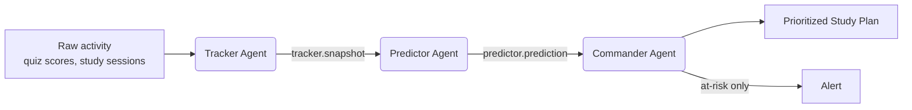

# Study Companion — Multi-Agent System

A minimal, dependency-free multi-agent system that helps a student stay on
track: three specialized agents communicate over a shared message bus and
shared tools to turn raw study activity into a prioritized study plan.

## Architecture



| Agent | Responsibility | Listens on | Publishes on |
|---|---|---|---|
| **Tracker** | Source of truth. Ingests quiz results & study sessions, rolls them up per subject. | `student.quiz_result`, `student.study_session` | `tracker.snapshot` |
| **Predictor** | Forecasts risk. Projects next score and classifies risk level per subject. | `tracker.snapshot` | `predictor.prediction` |
| **Commander** | Decision-maker. Turns predictions into a prioritized study plan and raises alerts for at-risk subjects. | `predictor.prediction` | `commander.plan_item`, `commander.alert` |

Agents never call each other directly — everything flows through the
`MessageBus` (`core/message_bus.py`), so you can add a 4th agent (e.g. a
`Notifier` that emails parents) without touching existing code.

Shared logic (data models, trend math, risk rules, plan templating) lives in
`core/tools.py` so all three agents call the *same* functions instead of
duplicating logic.

## Project layout

```
student-agents/
├── agents/
│   ├── base_agent.py     # shared scaffolding
│   ├── tracker.py        # Tracker agent
│   ├── predictor.py      # Predictor agent
│   └── commander.py      # Commander agent
├── core/
│   ├── message_bus.py    # pub/sub bus
│   └── tools.py          # data models + shared tool functions
├── main.py               # wires everything up, runs a demo week
├── requirements.txt
└── README.md
```

## Quickstart

```bash
cd student-agents
python main.py
```

Expected output: a log trace of the three agents talking to each other,
followed by a final report like:

```
============================================================
  STUDY PLAN  (Commander's final report)
============================================================
[P1] Math (45 min)
       -> Math needs immediate attention. Schedule short, frequent...
[P2] History (25 min)
       -> History is slipping slightly. Add one extra practice session...
[P3] Physics (15 min)
       -> Physics is in good shape. Maintain the current pace...
============================================================
```

## Extending it

- **Real forecasting**: replace `predict_next_score` / `classify_risk` in
  `core/tools.py` with a trained model or a call to a stats library.
- **LLM-authored plans**: replace the body of `llm_generate_study_plan` in
  `core/tools.py` with a real call to the Anthropic Messages API — the
  function signature (`Prediction -> str`) never has to change, so no other
  file needs editing.
- **New agents**: subclass `BaseAgent`, subscribe to whatever topics you
  need in `__init__`, and publish your own. E.g. a `NotifierAgent` that
  subscribes to `commander.alert` and sends an email/SMS.
- **Real data feed**: instead of `simulate_week()` in `main.py`, call
  `tracker.record_quiz(...)` / `tracker.record_session(...)` from wherever
  your app captures real student activity (a form, an LMS webhook, etc).

## Design choices worth knowing

- **Pub/sub over direct calls**: keeps agents decoupled and independently
  testable — you can unit-test `PredictorAgent` by publishing a fake
  `SubjectSnapshot` without ever touching `TrackerAgent`.
- **Dataclasses everywhere**: `QuizResult`, `StudySession`,
  `SubjectSnapshot`, `Prediction`, `StudyPlanItem` are all typed, so your
  editor/IDE will catch mistakes before you run anything.
- **No external dependencies required**: runs anywhere Python 3.9+ runs.
  The `anthropic` SDK is optional, only needed once you plug in a real LLM.
